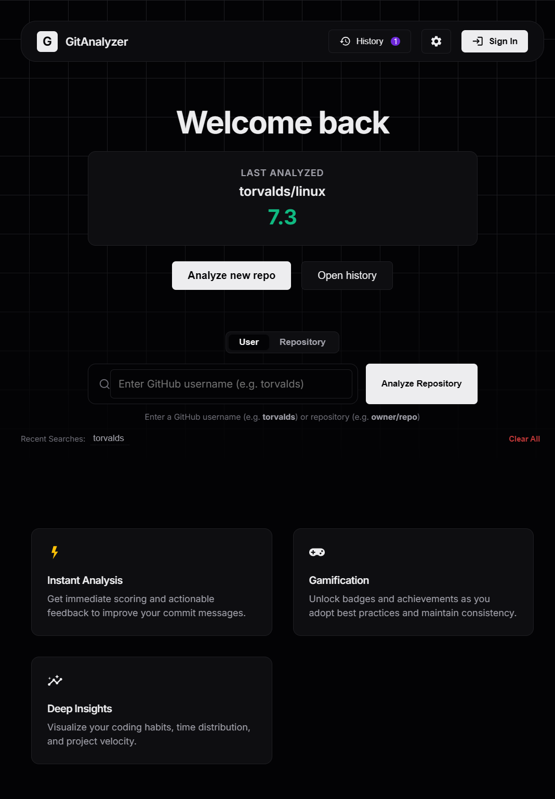
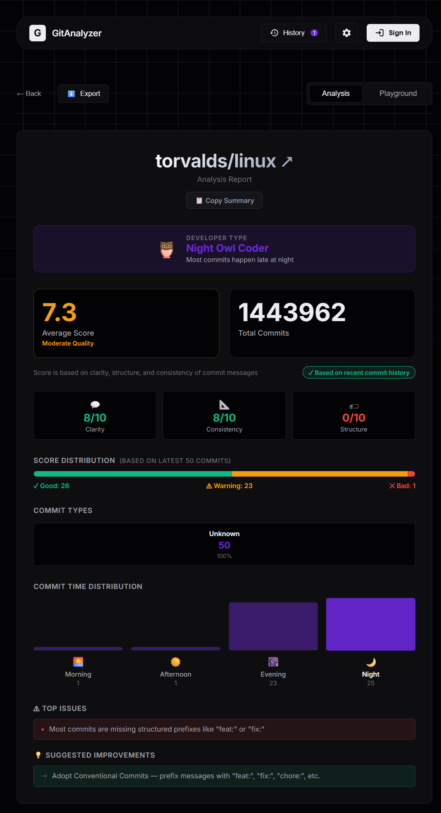
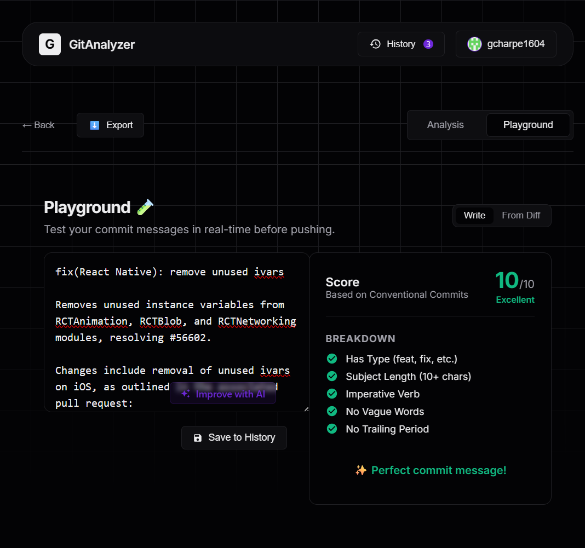

# GitAnalyzer

---

> Analyze commit quality. Understand developer behavior. Improve your Git workflow.  
> Turns commit analysis from a score into a feedback system.

---

## 🔗 Live Demo

**[gitanalyzer-ai.netlify.app](https://gitanalyzer-ai.netlify.app/)**

---

## 🚀 Overview

GitAnalyzer fetches commit data from any public GitHub user or repository and applies a rule-based scoring system to evaluate commit message quality. It surfaces common problems — vague language, missing structure, inconsistent style — and gives concrete suggestions to fix them.

Unlike generic linters, GitAnalyzer works at the repository level. It looks at patterns across all commits, not just a single message. It identifies a developer's commit style, flags systemic issues, and provides ranked suggestions. For logged-in users, it also offers AI-powered commit message improvements and saves analysis history across sessions.

---

## Key Features

- **Commit scoring (0–10)** — Scores commit messages based on clarity, structure, and consistency

- **Sub-score breakdown** — Three sub-metrics displayed alongside the main score:
  - **Clarity** — penalizes messages that start with vague terms like `fix`, `update`, `wip`, or `misc`
  - **Structure** — measures what percentage of commits use typed prefixes (`feat:`, `fix:`, `chore:`, etc.)
  - **Consistency** — evaluates how uniform commit quality is across the repository using score variance

- **Confidence indicator** — If a repository has fewer than 20 commits, the dashboard shows a low-confidence warning so you know the data is limited

- **Top Issues** — Automatically identifies the most impactful problems:
  - High rate of vague commit openers
  - Missing Conventional Commits prefixes
  - High score variance across contributors
  - Bad commit percentage above a threshold

- **Suggested Improvements** — Rule-based suggestions derived from each repository's specific weaknesses (not generic advice)

- **Developer Type classification** — Categorizes commit behavior into one of four types: *Night Owl Coder*, *Consistent Builder*, *Burst Committer*, or *Weekend Hacker* — based on time-of-day and day-of-week patterns

- **Dashboard visualizations** — Commit time distribution chart, commit type breakdown, score distribution bar, and history timeline

- **AI commit suggestions (logged-in users only)** — Logged-in users can request an AI-rewritten version of any commit message. The AI strictly follows Conventional Commits and enforces imperative mood. This feature is gated to manage API usage and provide a personalized experience. Supported providers: Gemini, OpenRouter, Groq (with automatic fallback)

- **Persistent analysis history** — Logged-in users have their repository analyses saved to Supabase. Guest sessions use localStorage

- **Authentication** — Email/password sign-up and sign-in via Supabase Auth. Username is collected at registration and displayed in the navbar

- **Copy Summary** — One-click button to copy a plain-text analysis summary to the clipboard

---

## How It Works

1. **Enter a target** — Type a GitHub username (e.g. `torvalds`) or a repository path (e.g. `facebook/react`) into the search bar
2. **Data is fetched** — The GitHub API returns up to 100 recent commits from the target
3. **Messages are analyzed** — Each commit message is scored individually using the rule-based engine
4. **Insights are computed** — Sub-scores, developer type, top issues, and suggestions are derived from aggregate patterns
5. **Dashboard renders** — Results are displayed across score cards, charts, and feedback sections
6. **AI suggestions** (logged-in only) — Users can click "Improve with AI" on any commit to get a rewritten message
7. **History is saved** — Logged-in users have the analysis persisted to their Supabase profile for future reference

---

## Scoring System

Each commit message starts at a score of 10. Points are deducted for:

| Rule | Deduction |
|------|-----------|
| Missing Conventional Commits prefix (e.g. `feat:`) | −2 |
| Subject line shorter than 10 characters | −2 |
| Contains vague words (`stuff`, `things`, `wip`, `misc`) | −2 |
| Subject does not start with an imperative verb | −1 |
| Subject ends with a period | −1 |

**Score interpretation:**
- `8–10` → Good
- `6–7` → Warning
- `0–5` → Bad

**Examples:**

```
❌  fix bug
    Score: 4/10 — missing prefix, too short, non-specific subject

✅  fix(auth): remove null check in login token validator
    Score: 10/10 — typed prefix, imperative verb, specific subject, correct length
```

---

## Architecture

```
┌─────────────────────────────────────────────┐
│                  Browser                    │
│                                             │
│  React + TypeScript (Vite)                  │
│  ├── InputSection   → user/repo entry       │
│  ├── SummarySection → scores + insights     │
│  ├── CommitList     → per-commit breakdown  │
│  ├── Playground     → AI suggestion editor  │
│  └── HistorySidebar → saved analyses        │
└──────────────┬──────────────────────────────┘
               │
       ┌───────▼────────┐
       │  GitHub REST   │
       │  API v3        │
       └───────┬────────┘
               │
    ┌──────────▼──────────────┐
    │  Rule-Based Analyzer    │
    │  simpleAnalyzer.ts      │
    │  - per-commit scoring   │
    │  - sub-score aggregation│
    │  - feedback generation  │
    └──────────┬──────────────┘
               │
    ┌──────────▼──────────────┐
    │  AI Layer (optional)    │
    │  llmService.ts          │
    │  Gemini → OpenRouter    │
    │          → Groq         │
    └──────────┬──────────────┘
               │
    ┌──────────▼──────────────┐
    │  Supabase               │
    │  - Auth (email/password)│
    │  - Analysis persistence │
    └─────────────────────────┘
```

---

## Tech Stack

| Layer | Technology |
|---|---|
| Framework | React 18 + TypeScript |
| Build Tool | Vite |
| Styling | Vanilla CSS with CSS custom properties |
| Data Source | GitHub REST API v3 |
| AI Providers | Google Gemini, OpenRouter, Groq |
| Auth + Database | Supabase |
| Deployment | Netlify |

---

## Screenshots

| Dashboard | Commit Analysis | AI Suggestion |
|---|---|---|
|  |  |  |

---

## Setup

### Prerequisites

- Node.js ≥ 18
- A [Supabase](https://supabase.com) project (for auth and history)
- Optional: API keys for Gemini, OpenRouter, or Groq (for AI suggestions)

### Steps

```bash
# 1. Clone the repository
git clone https://github.com/gcharpe1604/gitanalyzer.git
cd gitanalyzer

# 2. Install dependencies
npm install

# 3. Configure environment variables
cp .env.example .env
# Edit .env with your values

# 4. Start the development server
npm run dev
```

### Environment Variables

```env
# Supabase (required for auth and history)
VITE_SUPABASE_URL=https://your-project.supabase.co
VITE_SUPABASE_ANON_KEY=your-anon-key

# GitHub token (optional — increases rate limit from 60 to 5000 req/hr)
VITE_GITHUB_TOKEN=your_github_token

# AI providers (optional — at least one required for AI suggestions)
VITE_GEMINI_API_KEY=your_gemini_key
VITE_OPENROUTER_API_KEY=your_openrouter_key
VITE_GROQ_API_KEY=your_groq_key
```

> The app works without AI keys — scoring and insights are fully rule-based. AI suggestions are only activated when at least one provider key is configured and the user is signed in.

---

## Why Commit Messages Matter

A commit message is documentation written at the moment of change — when context is freshest. Poor commit histories make code review harder, debug sessions slower, and onboarding more painful.

Tools like `git blame`, `git bisect`, and changelogs all depend on meaningful commit messages. Yet most teams treat commit messages as an afterthought.

GitAnalyzer makes the quality of commit messages visible. By scoring and surfacing patterns at the repository level, it gives developers and teams a concrete starting point for improvement — without needing to read through hundreds of commits manually.

---

## License

MIT
