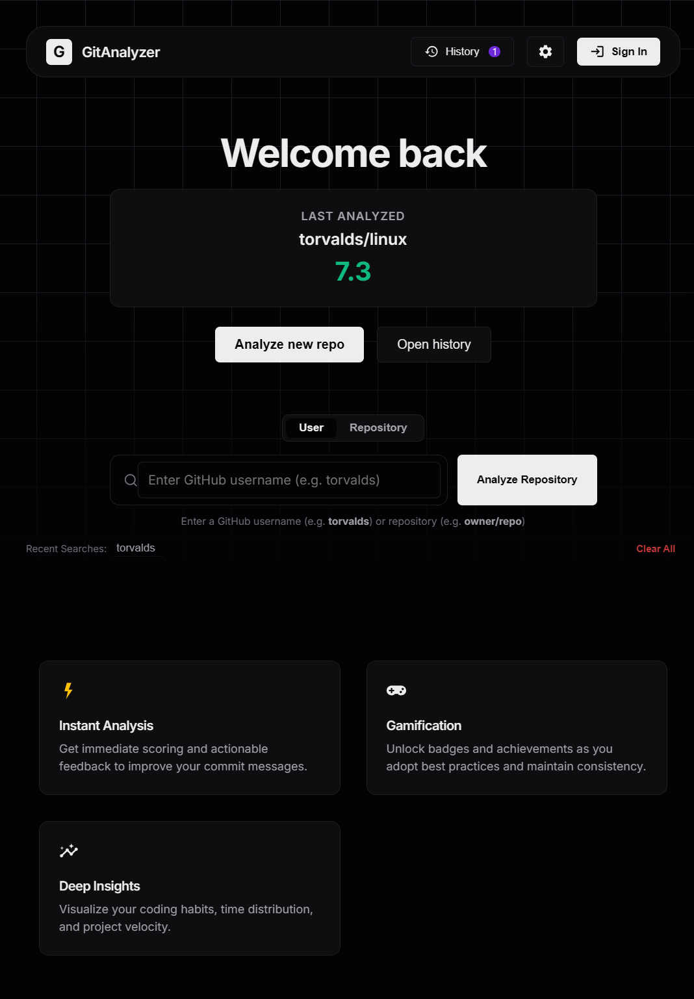
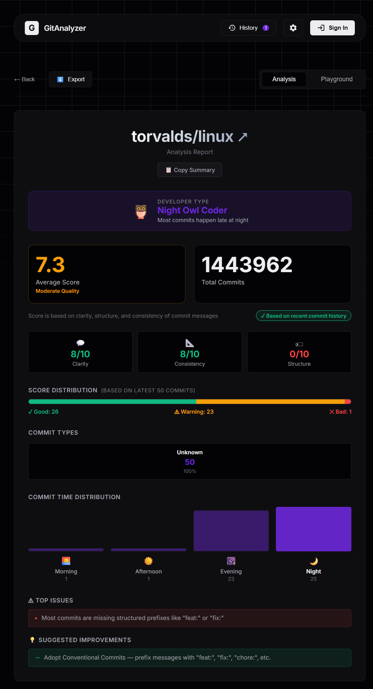
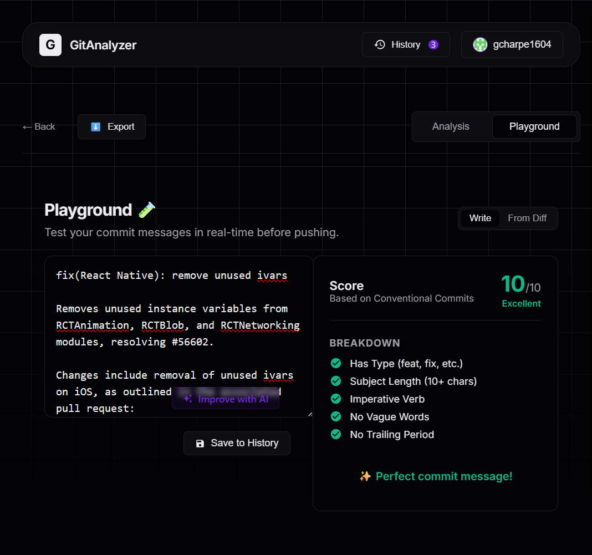

# GitAnalyzer

---

> Analyze commit quality. Understand developer behavior. Improve your Git workflow.  
> Turns commit analysis from a score into a feedback system.

---

## 🔗 Live Demo

**[gitanalyzer-ai.netlify.app](https://gitanalyzer-ai.netlify.app/)**

---

## 📈 Status

Actively developed. Open to feedback and improvements.

---

## 🚀 Overview

GitAnalyzer fetches commit data from any public GitHub user or repository and applies a rule-based scoring system to evaluate commit message quality. It surfaces common problems — vague language, missing structure, inconsistent style — and gives concrete suggestions to fix them.

Unlike generic linters, GitAnalyzer works at the repository level. It looks at patterns across all commits, not just a single message. It identifies a developer's commit style, flags systemic issues, and provides ranked suggestions. Signed-in users can also generate a commit message from a pasted git diff and sync analysis history across sessions.

---

## Key Features

- **Commit scoring (0–10)** — Uses a weighted, explainable rubric across format, clarity, style, context, and hygiene

- **Sub-score breakdown** — Three sub-metrics displayed alongside the main score:
  - **Clarity** — measures specificity, useful subject length, and placeholder language
  - **Structure** — measures valid Conventional Commit headers, types, and scopes
  - **Consistency** — evaluates how uniform commit quality is across the repository using score variance

- **Confidence indicator** — If a repository has fewer than 20 commits, the dashboard shows a low-confidence warning so you know the data is limited

- **Top Issues** — Automatically identifies the most impactful problems:
  - High rate of vague commit openers
  - Missing Conventional Commits prefixes
  - High score variance across contributors
  - Bad commit percentage above a threshold

- **Suggested Improvements** — Rule-based suggestions derived from each repository's specific weaknesses (not generic advice)

- **Developer Type classification** — Categorizes commit behavior into one of four types: *Night Owl Coder*, *Consistent Builder*, *Burst Committer*, or *Weekend Hacker* — based on time-of-day and day-of-week patterns

- **Dashboard visualizations** — Commit time distribution chart, commit type breakdown, score distribution bar, and history timeline

- **Shareable routes** — The analyzer, developer repository index, repository reports, and commit workshop have stable browser URLs

- **Diff-grounded AI generation (logged-in users only)** — AI generation is available only after a user signs in, adds a provider key, and supplies a git diff. Supported providers: Gemini, OpenRouter, and Groq

- **Persistent analysis history** — Signed-in users have repository analyses saved to Supabase. Guest analyses are not added to history

- **Authentication** — Sign in or create an account with GitHub or Google through Supabase Auth

- **Detailed PDF reports** — Download one polished report containing the score summary, quality dimensions, priority findings, recommendations, type distribution, and commit appendix

---

## How It Works

1. **Enter a target** — Type a GitHub username (e.g. `torvalds`) or a repository path (e.g. `facebook/react`) into the search bar
2. **Data is fetched** — The GitHub API returns up to 100 recent commits from the target
3. **Messages are analyzed** — Each commit message is scored individually using the rule-based engine
4. **Insights are computed** — Sub-scores, developer type, top issues, and suggestions are derived from aggregate patterns
5. **Dashboard renders** — Results are displayed across score cards, charts, and feedback sections
6. **AI generation** (logged-in only) — Users paste a git diff in the Playground before requesting a generated commit message
7. **History is saved** — Logged-in users have the analysis persisted to their Supabase profile for future reference

---

## Scoring System

Each commit message is evaluated on a 100-point weighted rubric and presented as a 0–10 score:

| Dimension | Weight | What it checks |
|------|------:|-----------|
| Format | 20 | Valid Conventional Commit syntax, type, and optional scope |
| Clarity | 30 | Specificity, useful length, descriptive detail, and placeholder language |
| Style | 20 | Imperative mood, casing, punctuation, and readable phrasing |
| Context | 15 | Whether the subject identifies a meaningful action and whether complex changes include a body |
| Hygiene | 15 | Header length, whitespace, and subject/body separation |

Git-generated merge and revert messages are recognized separately so normal repository maintenance is not treated as malformed work.

**Score interpretation:**
- `8–10` → Good
- `6–7` → Warning
- `0–5` → Bad

**Examples:**

```
❌  fix bug
    Score: 4.7/10 — missing prefix, too short, placeholder subject

✅  feat(auth): prevent duplicate token refresh
    Score: 9.5/10 — valid structure, imperative wording, specific subject
```

---

## Architecture

```
┌─────────────────────────────────────────────┐
│                  Browser                    │
│                                             │
│  React + TypeScript (Vite)                  │
│  ├── InputSection   → user/repo entry       │
│  ├── SummarySection → scores + insights     │
│  ├── CommitList     → per-commit breakdown  │
│  ├── Playground     → scoring + diff generation│
│  ├── ReportDownload → detailed PDF report   │
│  └── HistorySidebar → saved analyses        │
└──────────────┬──────────────────────────────┘
               │
       ┌───────▼────────┐
       │  GitHub REST   │
       │  API v3        │
       └───────┬────────┘
               │
    ┌──────────▼──────────────┐
    │  Rule-Based Analyzer    │
    │  simpleAnalyzer.ts      │
    │  - per-commit scoring   │
    │  - sub-score aggregation│
    │  - feedback generation  │
    └──────────┬──────────────┘
               │
    ┌──────────▼──────────────┐
    │  AI Layer (optional)    │
    │  llmService.ts          │
    │  User-selected keys     │
    │  Groq / OpenRouter / Gemini│
    └──────────┬──────────────┘
               │
    ┌──────────▼──────────────┐
    │  Supabase               │
    │  - OAuth authentication │
    │  - Analysis persistence │
    └─────────────────────────┘
```

---

## 📁 Project Structure

```
src/
├── components/       # Reusable UI components (React)
├── contexts/         # React Context providers (Auth, Theme)
├── services/         # External API integrations (GitHub, Supabase, LLMs)
├── types/            # TypeScript type definitions
├── utils/            # Helper functions and analysis logic
├── App.tsx           # Main application component
└── main.tsx          # Application entry point
```

---

## Tech Stack

| Layer | Technology |
|---|---|
| Framework | React 19 + TypeScript |
| Routing | React Router |
| Build Tool | Vite |
| Styling | Vanilla CSS with CSS custom properties |
| Data Source | GitHub REST API v3 |
| AI Providers | Google Gemini, OpenRouter, Groq |
| PDF Reports | jsPDF |
| Auth + Database | Supabase |
| Deployment | Netlify |

---

## Screenshots

| Dashboard | Commit Analysis | AI Suggestion |
|---|---|---|
|  |  |  |

---

## Setup

### Prerequisites

- Node.js ≥ 18
- A [Supabase](https://supabase.com) project (for auth and history)
- Optional: an API key for Gemini, OpenRouter, or Groq, added after sign-in

### Steps

```bash
# 1. Clone the repository
git clone https://github.com/gcharpe1604/gitanalyzer.git
cd gitanalyzer

# 2. Install dependencies
npm install

# 3. Configure environment variables
cp .env.example .env
# Edit .env with your values

# 4. Start the development server
npm run dev
```

### Environment Variables

```env
# Supabase (required for auth and history)
VITE_SUPABASE_URL=https://your-project.supabase.co
VITE_SUPABASE_ANON_KEY=your-anon-key

# GitHub token (optional — increases rate limit from 60 to 5000 req/hr)
VITE_GITHUB_TOKEN=your_github_token

```

> The app works without AI keys — scoring and insights are fully rule-based. Provider keys are added from the signed-in account menu and remain in that browser, separated by account.

---

## Why Commit Messages Matter

A commit message is documentation written at the moment of change — when context is freshest. Poor commit histories make code review harder, debug sessions slower, and onboarding more painful.

Tools like `git blame`, `git bisect`, and changelogs all depend on meaningful commit messages. Yet most teams treat commit messages as an afterthought.

GitAnalyzer makes the quality of commit messages visible. By scoring and surfacing patterns at the repository level, it gives developers and teams a concrete starting point for improvement — without needing to read through hundreds of commits manually.

---

## License

MIT
